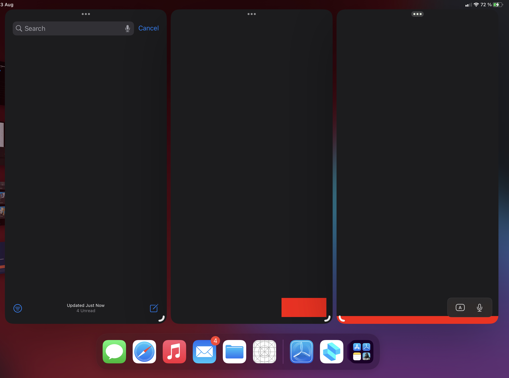

# Multi-window KB Layout Issues

## NSNotificationCenter

If application in app delegate (`application:didFinishLaunchingWithOptions:`) subscribes to `UIKeyboardDidChangeFrameNotification`. 

```objc
[NSNotificationCenter.defaultCenter addObserver:self selector:@selector(_kbFrameChanged:) name:UIKeyboardDidChangeFrameNotification object:nil];
```

In `_kbFrameChanged` there is no way to detect for what window (UIWindowScene) coordinates `UIKeyboardFrameEndUserInfoKey` frame is.

So there is no way to proper calculate screen coordinates for keyboard.

Note: This is only occurs when app has 2 or more UIWindowScenes on the screen.

Posible solution: Add `UIScreenKeyboardFrameEndUserInfoKey`

## UIKeyboardLayoutGuide

We suspect that TrackingLayoutGuide for keyboard also uses `UIKeyboardDidChangeFrameNotification` and it is also affected by this issue.

On following screenshot is example of this app. 2 and 3 windows are separate window scenes. Red view is constrained with `UIKeyboardLayoutGuide`.



```objc
[[_kbTrackerView.leadingAnchor constraintEqualToAnchor:self.view.keyboardLayoutGuide.leadingAnchor] setActive:YES];
[[_kbTrackerView.widthAnchor constraintEqualToAnchor: self.view.keyboardLayoutGuide.widthAnchor] setActive:YES];
[[_kbTrackerView.heightAnchor constraintEqualToAnchor: self.view.keyboardLayoutGuide.heightAnchor] setActive:YES];
[[_kbTrackerView.bottomAnchor constraintEqualToAnchor:self.view.keyboardLayoutGuide.bottomAnchor] setActive:YES];
self.view.keyboardLayoutGuide.followsUndockedKeyboard = YES;
```

And layout system also confuses between windows and apply wrong constrains to `_kbTrackerView` (red view).
